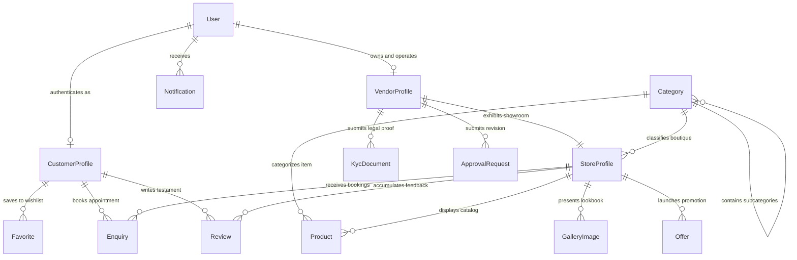

# HER AREA — Backend API Engine & System Design Blueprint

This folder (`backend/`) is designated for the upcoming **Django REST Framework (DRF)** backend server and **PostgreSQL** relational database interface that powers the entire HER AREA multi-application ecosystem (`app_user`, `app_vendor`, and `app_admin`).

---

## 📘 Phase 4 Design Architecture Deliverable
As completed in **Phase 4**, the complete engineering architecture and system design blueprint has been formulated prior to writing code. 

For the authoritative, exhaustive technical design document—including ER diagrams, database schemas, RBAC permission tables, approval state machines, REST API catalog, Azure cloud topology, and development roadmaps—please consult:
👉 **[`../docs/BACKEND_SYSTEM_DESIGN.md`](../docs/BACKEND_SYSTEM_DESIGN.md)**

---

## 1. Unified Django Project Structure
When backend implementation commences in Phase 5, the directory will be structured around modular domain apps representing isolated bounded contexts:

```
backend/
├── config/                     # Master Django settings (base, dev, production_azure), root URLs, ASGI
├── apps/                       # Core domain subsystems
│   ├── common/                 # Shared base models, soft-delete managers, custom DRF exception handlers
│   ├── accounts/               # User identity, JWT token rotation, OTP verification & RBAC permissions
│   ├── customers/              # Customer profiles, engagement metrics, account block registries
│   ├── vendors/                # Vendor accounts, legal KYC compliance tracking (GST/PAN), studio state
│   ├── business/               # Store showrooms, PostGIS spatial geographic coordinates, working hours
│   ├── categories/             # Marketplace taxonomy engine, custom icon mapping, visibility controls
│   ├── products/               # O2O product catalogs, pricing, stock toggles, moderation state queues
│   ├── gallery/                # Atelier craftsmanship lookbooks, visualizer image exhibits
│   ├── offers/                 # Promotional discount campaigns, coupon validation, timer logic
│   ├── reviews/                # Customer testaments, rating averages, vendor dispute report arbitration
│   ├── favorites/              # Saved boutique shortlists and wishlist collection trackers
│   ├── enquiries/              # O2O fitting appointment scheduling and chat progression threads
│   ├── notifications/          # In-app persistent alert feed and push broadcast engine
│   ├── approvals/              # Immutable audit trail for side-by-side business profile revision diffs
│   ├── analytics/              # Real-time server telemetry, regional bridal demand heatmaps, conversion KPIs
│   └── reports/                # Celery asynchronous task generators for CSV/PDF financial & GST audit ledgers
├── requirements/               # Dependency matrices (base, dev, production)
├── Dockerfile                  # Multi-stage production container build for Azure App Service / AKS
└── docker-compose.yml          # Local developer stack (PostgreSQL 16, Redis 7, Celery Worker)
```

---

## 2. Core ER Diagram & Entity Summary



---

## 3. Recommended Implementation Order (Phase 5 Strategy)
To avoid circular dependency conflicts and ensure clean schema builds, development must proceed in this sequence:

1. **`apps/common/` & Config**: Abstract domain base models (UUIDv4, audit timestamps, soft deletion).
2. **`apps/accounts/`**: Custom `User` identity, stateless JWT issuance, Twilio/WhatsApp OTP verification, and RBAC authorization classes.
3. **`apps/categories/`**: Taxonomy tree (prerequisite for classifying showrooms and products).
4. **`apps/vendors/` & `apps/business/`**: Partner profiles, public store showrooms, PostGIS spatial indexing, and pre-signed Azure Blob Storage KYC document vaults.
5. **`apps/products/`, `apps/gallery/`, & `apps/offers/`**: Bridal inventories, portfolio lookbooks, and promotional coupon validators.
6. **`apps/customers/`, `apps/favorites/`, & `apps/reviews/`**: Buyer profiles, wishlist shortlists, rating averages, and defamatory review dispute flags.
7. **`apps/enquiries/` & `apps/notifications/`**: O2O fitting appointment booking state machines and hybrid Notification Hub push alerts.
8. **`apps/approvals/`, `apps/analytics/`, & `apps/reports/`**: Executive governance diff comparison viewers, server telemetry aggregation, and Celery background CSV report compilation.

---
*For complete REST API endpoint catalogs, JSON payload schemas, security policies, and Azure cloud topology architectures, read **[`../docs/BACKEND_SYSTEM_DESIGN.md`](../docs/BACKEND_SYSTEM_DESIGN.md)**.*
