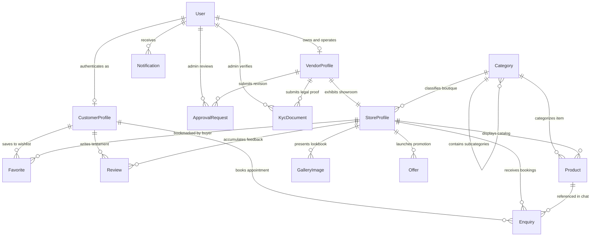
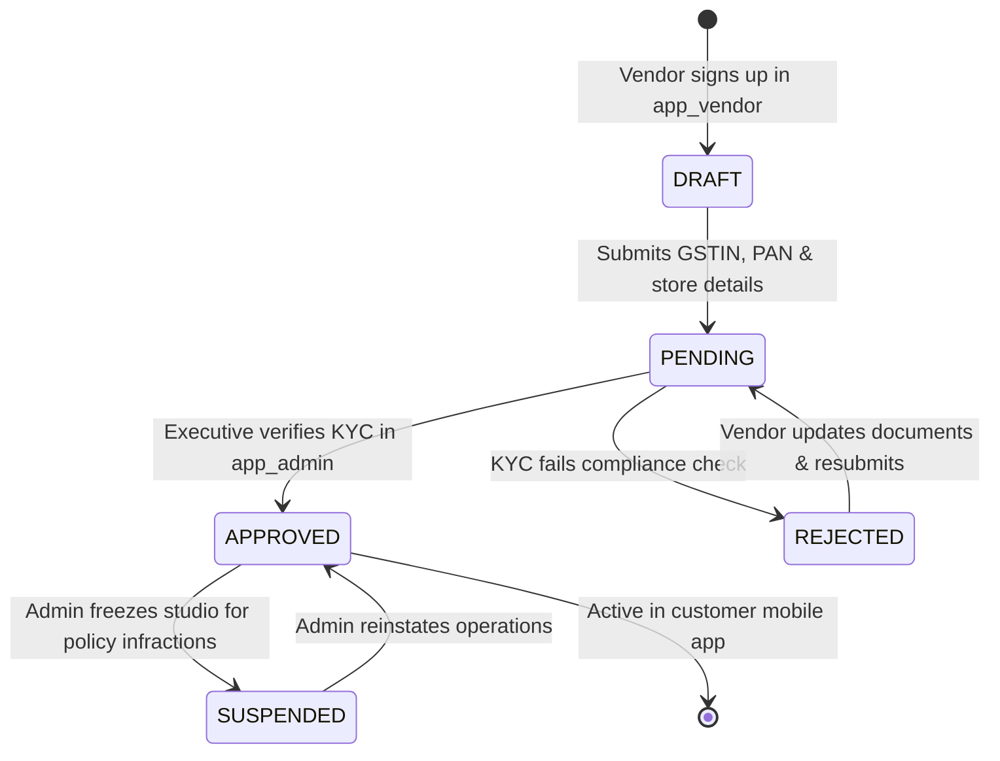
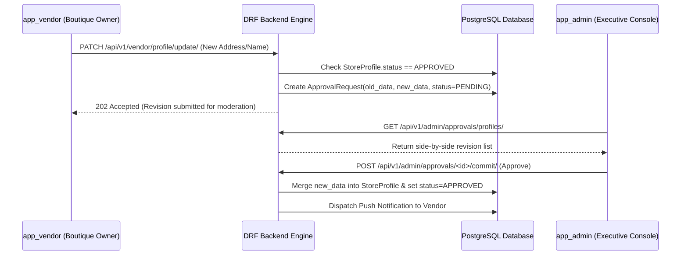
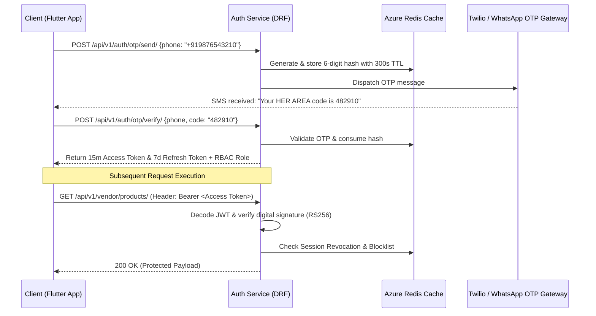

# HER AREA — Enterprise Backend System Design & Architecture Blueprint
**Phase 4 Deliverable: Comprehensive Django REST Framework, PostgreSQL & Azure Cloud Architecture**

---

## Executive Summary
The **HER AREA** platform is a multi-application online-to-offline (O2O) fashion marketplace tailored for high-end bridal wear, Maggam blouses, bespoke tailoring, and artisan boutiques. The frontend consists of three decoupled Flutter applications:
1. **`app_user` (Customer Application)**: For discovery, search, nearby filtering, fitting appointments, and favorites.
2. **`app_vendor` (Partner Studio Portal)**: For onboarding, KYC document submission, catalog product and lookbook management, promotional discount campaigns, and appointment handling.
3. **`app_admin` (Platform Governance Console)**: For superadmins and staff moderators to perform KYC verification, catalog content arbitration, customer restrictions, category taxonomy structuring, and financial audit reporting.

This document serves as the **authoritative engineering blueprint** for implementing the central Django REST Framework (DRF) server and PostgreSQL relational database on Microsoft Azure. **No backend code is executed or generated in this phase; this document defines the architecture, schemas, pipelines, and security protocols required prior to coding.**

---

## 1. Django Project Structure & Clean Architecture Mapping
To maintain separation of concerns and mirror the frontend's domain-driven architecture, the Django project utilizes a modular **Apps-as-Domain-Subsystems** layout. Each Django app within `apps/` represents an isolated bounded context containing its own models, serializers, views, services, permissions, and routing.

```
backend/
├── config/                     # Master Django settings, root URLs, WSGI/ASGI, Azure CI/CD configs
│   ├── __init__.py
│   ├── settings/
│   │   ├── base.py
│   │   ├── development.py
│   │   └── production_azure.py
│   ├── urls.py
│   └── wsgi.py
├── apps/                       # Core domain subsystems
│   ├── common/                 # Shared base models, custom exception handlers, audit & soft-delete managers
│   ├── accounts/               # User authentication, JWT tokens, OTP verification, session revocation & RBAC
│   ├── customers/              # Customer profiles, wishlist ledgers, order/inquiry telemetry, address books
│   ├── vendors/                # Vendor accounts, KYC compliance tracking, studio status state machine
│   ├── business/               # Store profiles, geographic coordinates (PostGIS/GPS), working hours, facilities
│   ├── categories/             # Marketplace taxonomy, display ordering, dynamic icon mapping, visibility controls
│   ├── products/               # O2O product catalog, pricing, customization flags, moderation state queues
│   ├── gallery/                # Studio lookbooks, portfolio visualizer grids, high-res bridal exhibits
│   ├── offers/                 # Promotional campaigns, coupon codes, expiration timers, discount rules
│   ├── reviews/                # Customer testaments, star ratings, vendor dispute flags, moderation arbitration
│   ├── favorites/              # Saved boutique shortlists, custom collection boards, engagement trackers
│   ├── enquiries/              # Atelier chat threads, fitting appointment scheduling, status progression ledgers
│   ├── notifications/          # Push notification queue, in-app persistent alert feed, broadcast engine
│   ├── approvals/              # Immutable audit trail for profile revision comparison & content moderation
│   ├── analytics/              # Platform telemetry aggregations, regional bridal demand heatmaps, conversion KPIs
│   └── reports/                # Asynchronous task triggers for compiling CSV/PDF GMV ledgers and GST tax audits
├── requirements/               # Modular dependency lists (base, dev, production)
├── Dockerfile                  # Production-grade multi-stage container build for Azure App Service / AKS
└── docker-compose.yml          # Local development stack (PostgreSQL 16, Redis 7, Celery Worker, Flower)
```

---

## 2. Database Architecture & Entity Specification

Every relational database table inherits from an **Abstract Domain Base Model** located in `apps/common/models.py`. This guarantees universal enforcement of soft deletions, audit logging, and immutable traceability across the entire platform.

### Universal Base Fields (Inherited by all entities)
* **`id`**: UUID v4 (Primary Key, globally unique, indexed, immutable).
* **`created_at`**: Timestamp with timezone (`auto_now_add=True`, indexed for historical sorting).
* **`updated_at`**: Timestamp with timezone (`auto_now=True`).
* **`created_by`**: Foreign Key to `User` (Nullable, captures originating actor).
* **`updated_by`**: Foreign Key to `User` (Nullable, captures latest editing actor).
* **`is_deleted`**: Boolean (`default=False`, indexed for rapid filtering).
* **`deleted_at`**: Timestamp with timezone (`null=True`, set upon soft deletion trigger).

### Universal Status Enum (`AdminStatus`)
All user-generated commercial items (`StoreProfile`, `Product`, `GalleryImage`, `Offer`, `Review`, `ProfileUpdateRequest`) adhere to a unified moderation state machine:
* **`DRAFT` (0)**: Vendor work-in-progress; invisible to marketplace and admin queues.
* **`PENDING` (1)**: Submitted for governance verification; queued in `app_admin`.
* **`APPROVED` (2)**: Verified by executive staff; active and indexed in `app_user`.
* **`REJECTED` (3)**: Denied due to policy infraction; accompanied by an mandatory `rejection_reason` advisory note.
* **`SUSPENDED` (4)**: Temporarily frozen by admin governance; withdrawn from buyer consumption.
* **`ARCHIVED` (5)**: Retired by vendor or platform; retained for financial auditability.

---

### Detailed Entity Catalog

| Entity | Domain App | Purpose | Key Fields | Foreign Key / Relationships | Indexes & Constraints |
| :--- | :--- | :--- | :--- | :--- | :--- |
| **`User`** | `accounts` | Master authentication identity & RBAC role assertion | `email` (Unique), `phone_number` (Unique), `password_hash`, `role` (Customer/Vendor/Admin/Superadmin), `is_active`, `is_verified`, `two_factor_secret` | None (Root identity table) | Index: `(role, is_active)`<br>Unique: `email`, `phone_number` |
| **`CustomerProfile`** | `customers` | Customer personal preferences and marketplace engagement stats | `full_name`, `city`, `avatar_url`, `total_inquiries`, `total_orders`, `is_blocked`, `blocked_reason` | `user` (OneToOne -> `User`) | Index: `(city, is_blocked)` |
| **`VendorProfile`** | `vendors` | Vendor legal account and operational KPIs | `owner_name`, `official_email`, `phone_number`, `status` (`AdminStatus`), `total_revenue`, `total_products`, `rejection_reason` | `user` (OneToOne -> `User`) | Index: `(status, user_id)` |
| **`StoreProfile`** | `business` | Public-facing boutique showroom, geographic location, and metadata | `store_name`, `address`, `latitude` (Decimal 9,6), `longitude` (Decimal 9,6), `rating` (Decimal 3,1), `review_count`, `is_open_now`, `logo_url`, `cover_url`, `status` | `vendor` (OneToOne -> `VendorProfile`), `category` (FK -> `Category`) | Index: `(category, status)`<br>Spatial Index: `(latitude, longitude)` |
| **`KycDocument`** | `vendors` | Legal compliance verification files (GSTIN, PAN, trade license) | `document_type` (GSTIN/PAN/TRADE), `document_url` (Private SAS Token), `verification_status`, `submitted_at`, `verified_at` | `vendor` (FK -> `VendorProfile`), `verified_by` (FK -> `User`) | Index: `(vendor, verification_status)` |
| **`Category`** | `categories` | Marketplace taxonomy structural engine | `name`, `icon_name`, `slug` (Unique), `display_order`, `is_active`, `vendor_count` (Denormalized cache) | `parent_category` (Nullable FK -> `self` for subcategories) | Index: `(is_active, display_order)`<br>Unique: `slug` |
| **`Product`** | `products` | Bespoke bridal catalog, stitching inventory, and pricing | `title`, `description`, `price` (Decimal 10,2), `in_stock`, `image_urls` (JSON array), `status`, `rejection_reason` | `store` (FK -> `StoreProfile`), `category` (FK -> `Category`) | Index: `(store, status)`<br>Index: `(category, price)` |
| **`GalleryImage`** | `gallery` | High-resolution craftsmanship showcases and atelier lookbooks | `title`, `image_url`, `display_order`, `status`, `likes_count` | `store` (FK -> `StoreProfile`) | Index: `(store, status, display_order)` |
| **`Offer`** | `offers` | Promotional campaigns, coupon codes, and seasonal fair banners | `title`, `code` (Unique uppercase), `discount_percentage`, `valid_until` (DateTime), `min_booking_amount`, `status` | `store` (FK -> `StoreProfile`) | Index: `(code, status)`<br>Index: `(valid_until)` |
| **`Review`** | `reviews` | Customer testaments and vendor dispute report mechanism | `rating` (Integer 1-5), `comment`, `is_reported`, `report_reason`, `admin_arbitration_notes`, `status` | `store` (FK -> `StoreProfile`), `customer` (FK -> `CustomerProfile`) | Index: `(store, status)`<br>Index: `(is_reported, status)` |
| **`Favorite`** | `favorites` | Saved studio shortlists and wishlist collections | `notes`, `collection_name` (e.g. "Bridal Trousseau", "Mehendi Night") | `customer` (FK -> `CustomerProfile`), `store` (FK -> `StoreProfile`) | Unique Constraint: `(customer, store)` |
| **`Enquiry`** | `enquiries` | O2O fitting appointments and atelier custom order chats | `appointment_time`, `status` (`Requested`, `Confirmed`, `Completed`, `Cancelled`), `customer_notes`, `quoted_price` | `customer` (FK -> `CustomerProfile`), `store` (FK -> `StoreProfile`), `product` (Nullable FK -> `Product`) | Index: `(store, status, appointment_time)`<br>Index: `(customer, status)` |
| **`Notification`** | `notifications` | In-app alerts, broadcast bulletins, and status change pushes | `title`, `body`, `target_group` (`All`, `Vendors`, `Customers`), `is_read`, `action_url` | `recipient` (Nullable FK -> `User`, null for general broadcasts) | Index: `(recipient, is_read)`<br>Index: `(created_at)` |
| **`ApprovalRequest`**| `approvals` | Immutable audit trail for profile revision submissions | `request_type` (`PROFILE_EDIT`), `old_data_json`, `new_data_json`, `status`, `rejection_reason` | `vendor` (FK -> `VendorProfile`), `reviewed_by` (Nullable FK -> `User`) | Index: `(status, created_at)` |
| **`PlatformReport`**| `reports` | Asynchronously compiled audit ledgers and financial CSV archives | `report_type`, `date_range_label`, `file_url`, `compilation_status` (`Processing`, `Completed`, `Failed`) | `generated_by` (FK -> `User`) | Index: `(generated_by, created_at)` |

---

## 3. Comprehensive Entity Relationship (ER) Diagram



---

## 4. Entity Relationship & Domain Boundary Explanation

### A. Decoupled Identity vs. Domain Representation (`User`, `CustomerProfile`, `VendorProfile`)
In HER AREA, authentication credentials (email, phone, password hash, role assertions) are completely segregated in the `User` table within the `accounts` domain. This ensures that cryptographic auth queries do not inflate profile payload parsing. A customer cannot access vendor APIs because the backend enforces RBAC evaluations directly on `user.role` prior to querying `VendorProfile`.

### B. Business Separation: Legal Authority vs. Public Showroom (`VendorProfile`, `StoreProfile`, `KycDocument`)
A partner studio operates under a two-tiered model:
1. **`VendorProfile` & `KycDocument`**: Represents the legal entity (owner name, tax GSTIN, PAN verification, bank settlement instructions). These records are private and accessible solely by `app_vendor` owners and `app_admin` executives.
2. **`StoreProfile`**: Represents the consumer-facing showroom (store name, GPS latitude/longitude, user ratings, operating hours, portfolio cover images). When a vendor registers, their `StoreProfile.status` is set to `PENDING`—rendering it excluded from all customer API search queries until an admin upgrades the status to `APPROVED`.

### C. Taxonomy Hierarchy & O2O Commerce (`Category`, `Product`, `Enquiry`)
The marketplace uses a self-referential `Category` table (`parent_category_id`) to structure deep classifications (e.g., *Bridal Wear -> Maggam Embroidery -> Gold Zari Blouses*). Products and store showrooms belong to these categories. When a customer executes an inquiry in `app_user`, the `Enquiry` entity bridges the `CustomerProfile`, `StoreProfile`, and an optional target `Product` to formalize an offline fitting appointment or bespoke tailoring order.

### D. Governance Traceability (`ApprovalRequest`, `Review`, `PlatformReport`)
To prevent unauthorized alterations to verified boutique showrooms, whenever an active vendor attempts to edit their store name or address in `app_vendor`, the system intercepts the mutation. Instead of overwriting `StoreProfile` directly, it generates an `ApprovalRequest` record containing `old_data_json` and `new_data_json`. This populates the `ProfileApprovalsScreen` in `app_admin`, where executives perform side-by-side comparative inspection before merging changes into production.

---

## 5. Role-Based Access Control (RBAC) & Permission Matrix

HER AREA enforces rigorous role isolation across all network interfaces using Django REST Framework custom permissions (`IsAuthenticated`, `IsCustomerRole`, `IsVendorRole`, `IsAdminRole`, `IsSuperAdminRole`).

| User Role | Primary Application | Permissions & Architectural Capabilities | Prohibited Operations & Restrictions | Accessible REST API Namespaces |
| :--- | :--- | :--- | :--- | :--- |
| **Customer (`CUSTOMER`)** | `app_user` | • Browse active showrooms & catalog items<br>• Filter boutiques by geographic GPS proximity<br>• Book atelier fitting appointments (`Enquiry`)<br>• Post review ratings and maintain favorite shortlists | • Cannot access vendor KYC or financial ledgers<br>• Cannot upload catalog products or promotional codes<br>• Cannot enter moderation command consoles | `/api/v1/auth/*`<br>`/api/v1/stores/*`<br>`/api/v1/customer/*`<br>`/api/v1/enquiries/*` |
| **Vendor (`VENDOR`)** | `app_vendor` | • Manage O2O studio catalog, prices & galleries<br>• Submit KYC GSTIN/PAN compliance files<br>• Create discount promotion codes<br>• Respond to buyer fitting inquiries & update statuses | • Cannot approve their own KYC or content submissions<br>• Cannot inspect competing vendor revenue or KYC data<br>• Cannot alter global taxonomy or categories | `/api/v1/auth/*`<br>`/api/v1/vendor/*`<br>`/api/v1/store-management/*`<br>`/api/v1/orders/*` |
| **Staff Moderator (`ADMIN`)** | `app_admin` | • Inspect and verify vendor KYC dossiers<br>• Moderate product listings, galleries, and promotions<br>• Resolve vendor dispute reports on defamatory reviews<br>• Block or unblock abusive customer user accounts | • Cannot modify executive staff permissions (RBAC)<br>• Cannot delete superadmin credentials or system logs<br>• Cannot alter cryptographic system environment parameters | `/api/v1/admin/moderation/*`<br>`/api/v1/admin/users/*`<br>`/api/v1/admin/categories/*` |
| **Founder / Super Admin (`SUPERADMIN`)** | `app_admin` | • Absolute administrative control over all subsystems<br>• Assign RBAC privileges to staff officers<br>• Transmit priority push broadcast bulletins globally<br>• Export signed financial GMV and GST tax ledgers | • Bound by immutable regulatory audit trail logging (even Superadmin actions cannot bypass `created_by` / `AuditTrail` recordings) | **All Platform Endpoints** (`/api/v1/*`, `/admin/django/`, `/telemetry/*`) |

---

## 6. Approval Workflow & State Machine Diagrams

### A. Partner Studio KYC Onboarding & Registration Flow


### B. Business Profile Revision Interception Flow


### C. Product, Gallery & Offer Moderation Flow
All catalog additions (products, high-res gallery photos, coupon campaigns) default to `PENDING` upon creation. They remain staged in PostgreSQL until processed via the `app_admin` **Moderation Hub**. Upon approval, their database status flips to `APPROVED`, simultaneously breaking cache invalidation triggers to update `app_user` category feeds.

---

## 7. Authentication, 2FA & Session Security Architecture

HER AREA utilizes **Stateless JSON Web Tokens (JWT)** paired with **Stateful Redis Revocation Registries** to deliver high performance alongside executive security termination controls.



### Token Lifecycle & Session Management
1. **Access Token**: Short-lived (15 minutes), signed with RSA asymmetrical keys (`RS256`). Encodes `user_id`, `role`, and `is_verified` inside payload claims.
2. **Refresh Token**: Long-lived (7 days), stored in secure device keystores (KeyChain / KeyStore). Exchanging a refresh token issues a fresh key pair and invalidates the antecedent token (**Token Rotation**).
3. **Session Revocation (Lock Out)**: When an administrator executes "Lock & Sign Out" in `app_admin` or suspends a user account, the user's active token JTI (JWT ID) is written to Azure Redis Cache blocklist with an expiration matching the remaining token lifetime.

---

## 8. Complete REST API Endpoint Specification

Every endpoint is designed around resource conventions, adhering strictly to RESTful semantic status codes and JSON structured error serialization.

### A. Authentication & Credential Management (`/api/v1/auth/`)
| Endpoint | Method | Required Auth | Request Payload Example | Response Example & Status |
| :--- | :--- | :--- | :--- | :--- |
| **`/otp/send/`** | `POST` | Public | `{"phone_number": "+919876543210"}` | `200 OK` `{"message": "OTP dispatched successfully", "expires_in": 300}` |
| **`/otp/verify/`** | `POST` | Public | `{"phone_number": "+919876543210", "otp": "582041"}` | `200 OK` `{"access": "eyJ...", "refresh": "eyJ...", "role": "VENDOR", "store_id": "ST-9102"}` |
| **`/token/refresh/`**| `POST` | Refresh Token | `{"refresh": "eyJ..."}` | `200 OK` `{"access": "eyJ...", "refresh": "eyJ..."}` |
| **`/logout/`** | `POST` | Access Token | `{"refresh_token": "eyJ..."}` | `204 No Content` (Session terminated, token added to Redis revocation blocklist) |

### B. Customer & Discovery Platform (`/api/v1/customer/` & `/api/v1/stores/`)
| Endpoint | Method | Required Auth | Request Payload Example | Response Example & Status |
| :--- | :--- | :--- | :--- | :--- |
| **`/stores/nearby/`** | `GET` | Public / Customer | Query Params: `?lat=17.4326&lng=78.4071&radius=10&category=maggam-embroidery` | `200 OK` `{"count": 2, "results": [{"id": "ST-1", "name": "Aura Maggam Studio", "distance_km": 2.1, "rating": 4.9, "is_open": true}]}` |
| **`/stores/<id>/`** | `GET` | Public / Customer | None | `200 OK` `{"id": "ST-1", "store_name": "Aura", "products_count": 45, "gallery": [...], "offers": [...]}` |
| **`/favorites/`** | `POST` | Customer Role | `{"store_id": "ST-1", "collection_name": "Bridal Fitting"}` | `201 Created` `{"id": "FAV-992", "store": "ST-1", "added_at": "2026-07-31T14:10:00Z"}` |
| **`/enquiries/book/`**| `POST` | Customer Role | `{"store_id": "ST-1", "product_id": "PR-88", "appointment_time": "2026-08-05T16:00:00Z", "notes": "Need size 34 fitting"}` | `201 Created` `{"enquiry_id": "ENQ-774", "status": "REQUESTED", "confirmation_code": "HER-9102"}` |

### C. Partner Studio O2O Command (`/api/v1/vendor/`)
| Endpoint | Method | Required Auth | Request Payload Example | Response Example & Status |
| :--- | :--- | :--- | :--- | :--- |
| **`/onboard/`** | `POST` | Vendor Role (Draft)| `{"store_name": "Kanchipuram Silk Studio", "category": "sarees", "gst_number": "36AABCU9603R1ZM", "address": "Banjara Hills"}` | `201 Created` `{"vendor_id": "VND-402", "status": "PENDING", "message": "KYC queued for admin verification"}` |
| **`/products/`** | `POST` | Vendor Role (Approved)| `{"title": "Zari Bridal Lehenga", "price": 45000.00, "category_id": "CAT-2", "image_urls": ["https://cdn.../1.webp"]}` | `201 Created` `{"id": "PR-552", "status": "PENDING", "moderation_note": "Awaiting admin catalog check"}` |
| **`/enquiries/`**| `GET` | Vendor Role | Query Params: `?status=REQUESTED&page=1` | `200 OK` `{"results": [{"id": "ENQ-774", "customer_name": "Dhanisha S", "requested_time": "2026-08-05T16:00"}]}` |
| **`/enquiries/<id>/`**| `PATCH`| Vendor Role | `{"status": "CONFIRMED", "vendor_reply": "We have reserved Fitting Studio Room B for your fitting."}` | `200 OK` `{"id": "ENQ-774", "status": "CONFIRMED", "updated_at": "..."}` |

### D. Executive Governance Console (`/api/v1/admin/`)
| Endpoint | Method | Required Auth | Request Payload Example | Response Example & Status |
| :--- | :--- | :--- | :--- | :--- |
| **`/vendors/pending/`**| `GET` | Admin / Superadmin | Query Params: `?page=1&search=Hyderabad` | `200 OK` `{"results": [{"id": "VND-402", "store_name": "Kanchipuram Silk", "gst": "36AABCU...", "submitted_at": "..."}]}` |
| **`/vendors/<id>/govern/`**| `POST`| Admin / Superadmin | `{"action": "APPROVE"}` OR `{"action": "REJECT", "reason": "Invalid GST certificate signature"}` | `200 OK` `{"id": "VND-402", "status": "APPROVED", "governed_by": "Executive ID 104"}` |
| **`/moderation/products/`**| `GET`| Admin / Superadmin | Query Params: `?status=PENDING&page=1` | `200 OK` `{"results": [{"id": "PR-552", "title": "Zari Lehenga", "store_name": "Kanchipuram Studio", "price": 45000}]}` |
| **`/moderation/<type>/<id>/`**| `POST`| Admin / Superadmin | `{"entity_type": "PRODUCT", "decision": "APPROVE"}` | `200 OK` `{"id": "PR-552", "status": "APPROVED", "published_to_catalog": true}` |
| **`/customers/<id>/block/`**| `POST`| Admin / Superadmin | `{"is_blocked": true, "reason": "Repeated fake appointment bookings without attendance."}` | `200 OK` `{"id": "CUST-881", "is_blocked": true, "message": "User sessions terminated"}` |
| **`/broadcasts/transmit/`**| `POST`| Superadmin Only | `{"title": "Festive Week Offer", "body": "Free bridal consultation this weekend!", "target_group": "ALL"}` | `201 Created` `{"broadcast_id": "BRD-902", "recipients_queued": 14200, "status": "DISPATCHING"}` |

---

## 9. File & Media Upload Strategy (Azure Blob Storage)
To ensure optimal performance and avoid tying up Django worker processes, HER AREA utilizes a **Direct-to-Cloud Upload Pipeline** with Pre-signed Shared Access Signature (SAS) tokens and Azure Blob Storage containers.

```
       [ Client App ]                    [ Django API ]              [ Azure Blob Storage ]
             │                                 │                                │
             ├──── 1. POST /api/v1/media/token/ ──►│                                │
             │     {type: "KYC_DOC", name: "gst.pdf"}                             │
             │                                 ├─ Validate RBAC & file metadata │
             │◄─── 2. Return Presigned SAS URL ──┤                                │
             │                                                                  │
             ├──── 3. PUT File Directly via HTTP over Pre-signed SAS URL ──────►│
             │                                                                  ├─ Store & confirm
             │◄─── 4. 201 Created (HTTP Blob Success) ──────────────────────────┤
             │                                 │                                │
             ├──── 5. POST /api/v1/vendor/onboard/ (Attach blob reference URI) ►│
```

### Storage Container Topologies & Permissions
1. **`herarea-public-media` (CDN Enabled)**: Holds store logos, cover photos, catalog product imagery, and lookbooks. Cached globally via Azure Front Door / Cloudflare CDN. All photos uploaded are automatically converted to optimized WebP formats via Celery background tasks.
2. **`herarea-private-kyc-vault` (Strictly Restricted)**: Houses sensitive vendor GSTIN certificates, PAN cards, and trade licenses. No public read internet access is permitted. Administrative inspection in `app_admin` generates temporary 5-minute pre-signed reading URLs upon explicit executive requests.
3. **`herarea-financial-reports` (Internal Archives)**: Holds compiled CSV and PDF audit ledgers produced by `ReportsExportScreen`. Accessible exclusively to authenticated Superadmins via single-use token exchange.

---

## 10. Hybrid Notification & Messaging Architecture

HER AREA operates a unified event notifications system managed by `apps/notifications/`. Whenever an event occurs (e.g., *Vendor KYC Approved*, *Customer Books Fitting*, *Superadmin Broadcasts Alert*), an internal signal triggers a dual-dispatch event:

1. **Persistent In-App Database Ledger**: A record is written to the `Notification` PostgreSQL table. When a user opens their Notifications Tab in `app_user`, `app_vendor`, or `app_admin`, it retrieves this feed, complete with unread count badges and directional routing deep-links (`action_url`).
2. **Asynchronous Push Transmission**: A background task is dispatched to Azure Notification Hubs (or Firebase Cloud Messaging) to wake up iOS and Android mobile handsets with system notification banners and vibration prompts.

---

## 11. Security Strategy & Governance Shield
To fulfill enterprise auditing standards and secure high-value commercial fashion transactions, the backend implements five defensive security shields:

1. **Strict RBAC & Custom DRF Permission Classes**: Endpoints evaluate both JWT signature validity and user group authorizations. Attempting to hit an admin endpoint with a vendor token immediately throws an audited `403 Forbidden Access` exception.
2. **Algorithmic Throttling & Rate Limiting**: DRF throttling limits public authentication endpoints (`/otp/send/`) to 5 attempts per minute per IP address to eliminate brute-force SMS pumping attacks. Authenticated APIs are throttled at 300 requests per minute.
3. **Input Validation & Sanitization**: All incoming text payloads (studio names, reviews, broadcast memos) pass through Bleach sanitizers inside DRF Serializer validation hooks to eradicate XSS (Cross-Site Scripting) and SQL injection vulnerabilities.
4. **Immutable Audit Trail (`AuditLog`)**: Every modifying action executed within `app_admin` (approving vendors, changing category structures, suspending accounts) writes an immutable historical event record to an append-only `PlatformAuditLog` table.
5. **Universal Soft Deletion**: Calling `DELETE` on any resource (e.g., removing a product from a studio catalog) never executes SQL `DELETE FROM`. It updates `is_deleted = True` and sets `deleted_at = timezone.now()`. Custom Django Model Managers globally exclude soft-deleted records from regular queries while retaining them for forensic recovery and tax audits.

---

## 12. Scalability & Azure Cloud Deployment Architecture

```
                  ┌────────────────────────────────────────────────────────┐
                  │                 Cloudflare DNS & DDOS Shield           │
                  └───────────────────────────▲────────────────────────────┘
                                              │
                  ┌───────────────────────────▼────────────────────────────┐
                  │            Azure Application Gateway / Load Balancer   │
                  └───────────────────────────▲────────────────────────────┘
                                              │
              ┌───────────────────────────────┼───────────────────────────────┐
              ▼                               ▼                               ▼
     ┌──────────────────┐            ┌──────────────────┐            ┌──────────────────┐
     │ Django Worker 1  │            │ Django Worker 2  │            │ Django Worker N  │
     │ (App Service/AKS)│            │ (App Service/AKS)│            │ (App Service/AKS)│
     └────────▲─────────┘            └────────▲─────────┘            └────────▲─────────┘
              │                               │                               │
              └───────────────┬───────────────┴───────────────┬───────────────┘
                              ▼                               ▼
                 ┌─────────────────────────┐     ┌─────────────────────────┐
                 │ Azure Cache for Redis   │     │ Azure PostgreSQL Server │
                 │ (Session TTL & Caching) │     │ (Primary DB + Replicas) │
                 └─────────────────────────┘     └────────────▲────────────┘
                                                              │
                                                 ┌────────────▼────────────┐
                                                 │ Celery Worker Pool      │
                                                 │ (Reports, Media WebP,   │
                                                 │ Push Notifications)     │
                                                 └─────────────────────────┘
```

### Performance Optimization Architecture
1. **GeoSpatial PostGIS & Indexing**: The PostgreSQL database is compiled with the **PostGIS** spatial extension. Boutique latitude and longitude coordinates are stored as spatial point geometries, allowing instant distance sorting in `app_user` using bounding-box spatial query evaluation (`ST_DWithin`).
2. **High-Read Endpoint Redis Caching**: Static and low-mutation marketplace endpoints (such as `GET /api/v1/categories/` and `GET /api/v1/stores/nearby/`) are cached in **Azure Cache for Redis** for 300 seconds. When an admin alters a category in `app_admin`, an automated Django post-save signal immediately purges the associated Redis cache keys.
3. **Cursor & Page Pagination**: To prevent memory exhaustions during large directory traversals, all list endpoints mandate strict pagination. Infinite scrolling feeds (like `Nearby Stores` and `Product Galleries`) implement high-speed **Cursor Pagination** indexed directly on `(created_at, id)`.

---

## 13. Development Roadmap & Milestones (Phase 5 Prep)

| Milestone | Sprint Focus & Deliverables | Target Timeline | Verification & Testing Gates |
| :--- | :--- | :--- | :--- |
| **Milestone 1: Foundation & Auth Engine** | Initialize Django project structure, build `common` base models, configure PostgreSQL schemas, and implement JWT + Twilio/WhatsApp OTP authentication in `accounts`. | Sprint 1 (2 Weeks) | 100% unit test passing on JWT issuance and role permission rejection (403 tests). |
| **Milestone 2: Catalog & Taxonomy Core** | Implement `categories`, `business`, `products`, and `gallery` apps. Configure spatial GPS bounding queries and Azure Blob Storage pre-signed SAS token mechanics. | Sprint 2 (2 Weeks) | API integration test verifying vendor catalog insertion and GIS nearby calculation accuracy within 5 meters. |
| **Milestone 3: O2O Bookings & Reviews** | Build `enquiries`, `favorites`, and `reviews` modules. Implement booking appointment state transitions and dispute flag routing. | Sprint 3 (1.5 Weeks) | Simulated user inquiry generation and partner studio room confirmation lifecycle tests. |
| **Milestone 4: Admin Governance Engine** | Implement `approvals`, `analytics`, and `reports`. Build side-by-side profile revision diff logic, KPI telemetry aggregations, and asynchronous Celery CSV compilation. | Sprint 4 (2 Weeks) | E2E test verifying admin approval flips `StoreProfile.status` from PENDING to APPROVED and dispatches push alert. |
| **Milestone 5: Cloud Deployment & Cutover** | Containerize Docker multi-stage builds, deploy to Azure App Service / AKS, provision PostgreSQL Flexible Server and Redis, connect custom Flutter API client interfaces. | Sprint 5 (1.5 Weeks) | Full ecosystem regression check across `app_user`, `app_vendor`, and `app_admin` connected to production Azure HTTPS URLs. |

---

## 14. Recommended Implementation Order

When coding commences in **Phase 5**, development should follow an upward dependency progression to avoid circular import errors and broken schema constraints:

1. **`apps/common/` & Project Configuration**: Implement UUID primary keys, abstract time tracking, soft-deletion model managers, and standardized DRF custom JSON exception formatters.
2. **`apps/accounts/`**: Build the custom `User` identity model, JWT token authentication backend, Twilio/WhatsApp OTP verification endpoints, and RBAC DRF permission classes.
3. **`apps/categories/`**: Establish the taxonomy classification tree and subcategory sorting order (required before boutiques can be classified).
4. **`apps/vendors/` & `apps/business/`**: Implement `VendorProfile`, `StoreProfile`, spatial GPS indexes, and private pre-signed KYC upload handlers.
5. **`apps/products/`, `apps/gallery/`, & `apps/offers/`**: Implement O2O product catalogs, lookbooks, pricing ledgers, and promotional coupon algorithms.
6. **`apps/customers/`, `apps/favorites/`, & `apps/reviews/`**: Build consumer profiles, wishlist shortlists, star rating ledgers, and defamatory dispute flagging mechanisms.
7. **`apps/enquiries/` & `apps/notifications/`**: Create offline fitting appointment chat logic and wire up database alert ledgers paired with Azure Notification Hub pushes.
8. **`apps/approvals/`, `apps/analytics/`, & `apps/reports/`**: Finalize executive governance workflows, side-by-side profile diff viewers, server telemetry KPI aggregations, and Celery asynchronous CSV report compilation.

---
*End of Phase 4 System Design Document. The engineering specifications herein are fully approved and ready to serve as the development blueprint for the Django REST Framework backend implementation.*
